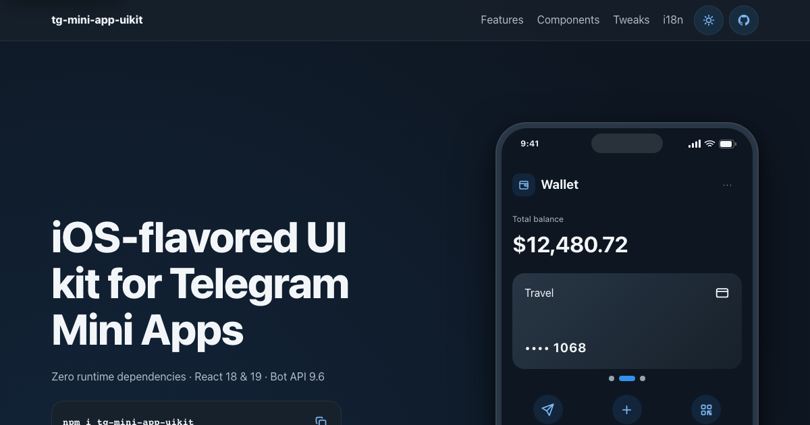
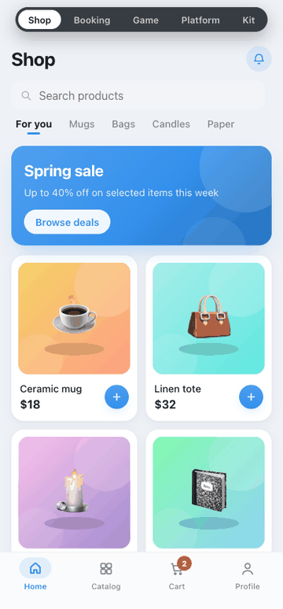

<div align="center">

# Telegram Mini App UIKit

**React 18/19 UI components and a typed Telegram WebApp layer for accessible, testable Mini Apps.**

[](https://www.npmjs.com/package/tg-mini-app-uikit)
[](https://github.com/lonmstalker/tg-mini-app-uikit/actions/workflows/ci.yml)
[](LICENSE)
[](packages/uikit)
[](packages/uikit/package.json)
[](packages/uikit/package.json)
[](https://github.com/lonmstalker/tg-mini-app-uikit/actions/workflows/docs.yml)
[](https://lonmstalker.github.io/tg-mini-app-uikit/)

<p>
  <a href="https://lonmstalker.github.io/tg-mini-app-uikit/">Landing</a> ·
  <a href="https://lonmstalker.github.io/tg-mini-app-uikit/demo/">Live demo (browser)</a> ·
  <a href="https://t.me/tg_mini_app_uikit_bot/demo">Telegram demo</a> ·
  <a href="https://lonmstalker.github.io/tg-mini-app-uikit/storybook/">Storybook</a> ·
  <a href="https://lonmstalker.github.io/tg-mini-app-uikit/docs/">Docs</a>
</p>

<p><em>The combined site routes go live after the GitHub Pages deploy runs. The Telegram route activates when the bot's <code>demo</code> Mini App is registered.</em></p>

</div>

<p align="center">
  
</p>

## Quick start

Install the package:

```bash
npm i tg-mini-app-uikit
```

Import the stylesheet once, then mount the Telegram runtime and theme providers near your app root:

```tsx
import "tg-mini-app-uikit/style.css";
import { TKProvider, TKTelegramProvider, TKPage } from "tg-mini-app-uikit";

export function App() {
  return (
    <TKTelegramProvider haptics>
      <TKProvider telegram style={{ height: "100dvh" }}>
        <TKPage>{/* screens */}</TKPage>
      </TKProvider>
    </TKTelegramProvider>
  );
}
```

### Develop this repo

```bash
npm install
npm run stories    # Storybook component explorer at http://localhost:6006
npm run docs:dev   # local static documentation site
npm run typecheck  # Telegram bridge and UIKit
npm run build      # workspace packages
```

## Highlights

- **Telegram-aware components.** The package covers typography, inputs, selection, lists, cards, overlays, feedback, navigation, gestures, commerce, booking, chat, feed, forms and wallet-status adapters.
- **Semantic design tokens.** `TKProvider` controls light and dark themes, accent, radius, density, type scale and motion. Its `telegram` mode maps the system to the active `--tg-theme-*` palette.
- **Typed platform layer.** The Bot API 9.6 bridge covers native buttons, back priorities, viewport and safe areas, haptics, popups, storage, invoices, sharing, permissions, sensors and device APIs. Plain-browser fallbacks and an injectable mock keep the same code testable outside Telegram.
- **WebView layout primitives.** `TKPage`, `TKSafeArea` and `TKBottomBar` combine CSS safe-area insets with live Telegram chrome and keyboard geometry.
- **Accessibility contracts.** The kit includes keyboard-operable controls, visible focus, named regions, focus-trapped overlays with focus return, reduced-motion handling and screen-reader status feedback.
- **Package discipline.** `tg-mini-app-uikit` declares zero runtime dependencies. React, React DOM and `@tg-mini-app/telegram` remain peer dependencies, with React 18 and React 19 support.

## See it in motion

<p align="center">
  
</p>

## Why this kit

- Compared with **Konsta**, the differentiator is the Telegram runtime surface: invoices, storage, haptics, back priorities, safe areas, fullscreen, sensors and a browser mock ship as first-class APIs.
- Compared with **TelegramUI**, the differentiator is package shape: strict TypeScript, React 18/19 peers and no package-owned runtime dependency stack.
- Compared with **VKUI**, the scope stays on Telegram WebApp constraints and reusable Mini App flows instead of a general social-platform design system.
- TON support stays optional. Wallet components are visual adapters, so the UIKit does not bundle or prescribe a wallet protocol.

## Telegram platform layer

Hooks read `window.Telegram.WebApp`, use explicit browser fallbacks and accept a mock through `<TKTelegramProvider webApp={...}>`.

| Hook | Telegram behavior | Plain-browser behavior |
| --- | --- | --- |
| `useWebApp()` / `useTelegramEvent()` | Raw WebApp access and typed events | `undefined` / no-op |
| `useTelegramTheme()` | Live color scheme and theme variables | Falls back to `"light"` |
| `useMainButton()` / `useSecondaryButton()` | Declarative native bottom buttons | No-op |
| `useBackButton()` / `useSettingsButton()` | Header buttons with mount cleanup | No-op |
| `useViewport()` / `useFullscreen()` / `useActivity()` | Viewport, fullscreen and active state | Static defaults / unsupported |
| `useSafeArea()` | Event-synced device and Telegram insets | Zero insets |
| `useHaptics()` | Impact, notification and selection feedback | No-op |
| `useTelegramPopup()` | Promise-based alerts, confirms and popups | `window.alert` / `window.confirm` |
| `useCloudStorage()` / `useDeviceStorage()` / `useSecureStorage()` | Promise-based storage with bulk helpers | Scoped `localStorage` fallback |
| `useInitData()` | User, start parameter and raw init data | Undefined values |
| `useTelegramLinks()` / `useInvoice()` / `useShare()` / `useDataTransport()` | Links, payments, sharing and data transport | Browser fallback / unsupported |
| `useClipboard()` / `useQrScanner()` / permission hooks | Native capability and permission prompts | Browser clipboard / unsupported |
| `useHomeScreen()` / `useEmojiStatus()` / `useDownloadFile()` / `useChatRequest()` | Bot API 8.0-9.6 client capabilities | Browser equivalent / unsupported |
| `useBiometrics()` / `useLocation()` / `useMotionSensors()` | Permission-gated device APIs | Unsupported |

The [`@tg-mini-app/telegram/testing`](packages/telegram/src/mock.ts) entry point provides an in-memory WebApp mock for unit and browser tests.

## Storybook

Package-local Storybook exposes theme, accent, roundness, locale, RTL, density, motion and preset controls. Stories live under [`packages/uikit/storybook`](packages/uikit/storybook), grouped by UIKit category. Playwright exercises the rendered story iframes, so public components can carry unit, visual, accessibility and e2e evidence together.

## Documentation

- The hosted [Docs](https://lonmstalker.github.io/tg-mini-app-uikit/docs/) cover setup, theming, the platform layer, components, API reference and recipes.
- Source pages live in [`docs/site/pages`](docs/site/pages); the package reference lives in [`packages/uikit/README.md`](packages/uikit/README.md).
- AI-oriented usage maps live in [`llms.txt`](llms.txt) and [`docs/llms-full.md`](docs/llms-full.md).

## Quality gates

| Gate | Repository contract |
| --- | --- |
| Unit | `npm run test:unit` runs the 1,245-test recorded UIKit baseline with Vitest and Testing Library. |
| E2E | `npm run check:e2e-count` requires at least 175 collected Playwright tests before `npm run test:e2e`. |
| Public surface | `npm run check:animatable`, `npm run check:api` and `npm run check:stories` guard animation properties, the 182-export API baseline, Storybook coverage and autodocs. |
| Package size | `npm run check:package` caps full ESM and CJS at 60 kB Brotli, `TKButton` at 5.5 kB and `TKSpinner` at 4 kB; it also runs publint and type-resolution checks. |

## What's inside

| Path | Purpose |
| --- | --- |
| [`packages/uikit`](packages/uikit) | Published React UIKit: tokens, components, templates and public re-exports. |
| [`packages/telegram`](packages/telegram) | Typed Bot API 9.6 React bridge and browser-testable Telegram mock. |
| [`packages/intl`](packages/intl) | Small localization engine with plural, locale resolution and date helpers. |
| [`packages/async`](packages/async) | Async state machines, stale guards, cursor pagination and mock gates. |
| [`examples/trailhead`](examples/trailhead) | Consumer-scale Telegram Mini App demo. |
| [`examples/surface-composer`](examples/surface-composer) | Flagship composition demo built from reusable UIKit surfaces. |
| [`examples/showcase`](examples/showcase) | Landing page and interactive browser demo published to Pages. |
| [`docs`](docs) | README media, static documentation sources and AI reference material. |
| [`e2e`](e2e) + [`scripts/check-e2e-count.mjs`](scripts/check-e2e-count.mjs) | Playwright Storybook suites and the collected-test floor gate. |

## Contributing

Issues and pull requests are welcome. For public behavior, include the relevant unit coverage and Storybook evidence, then run the matching gates from the table above.

## License

[MIT](LICENSE)
